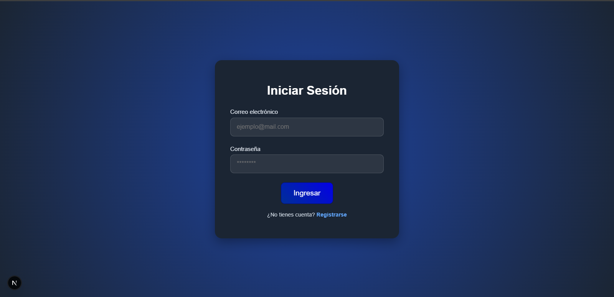
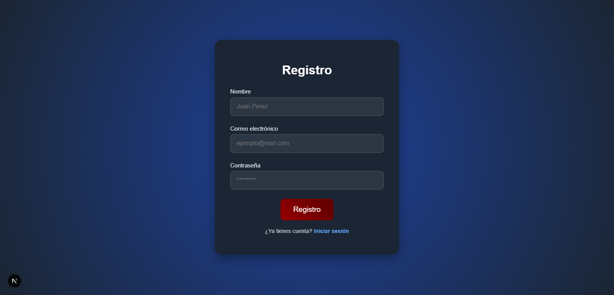
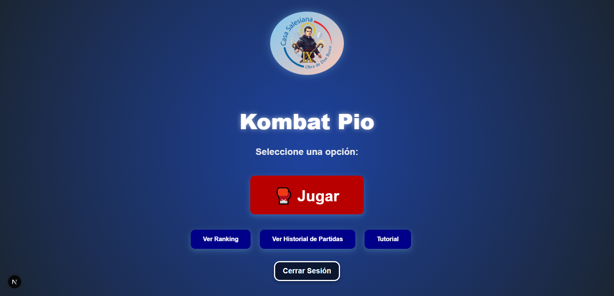
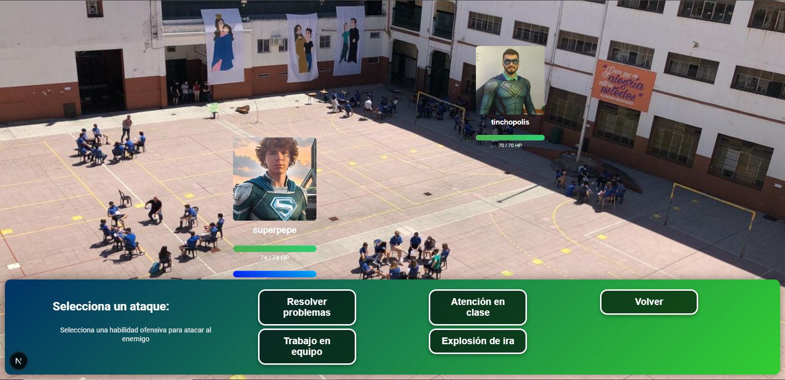
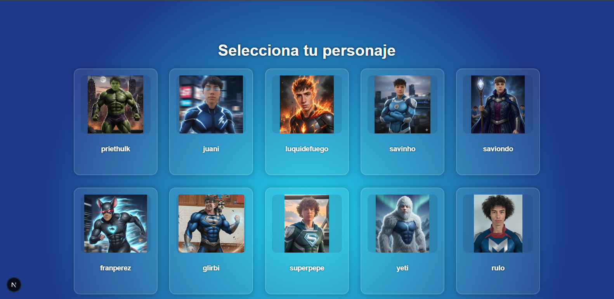
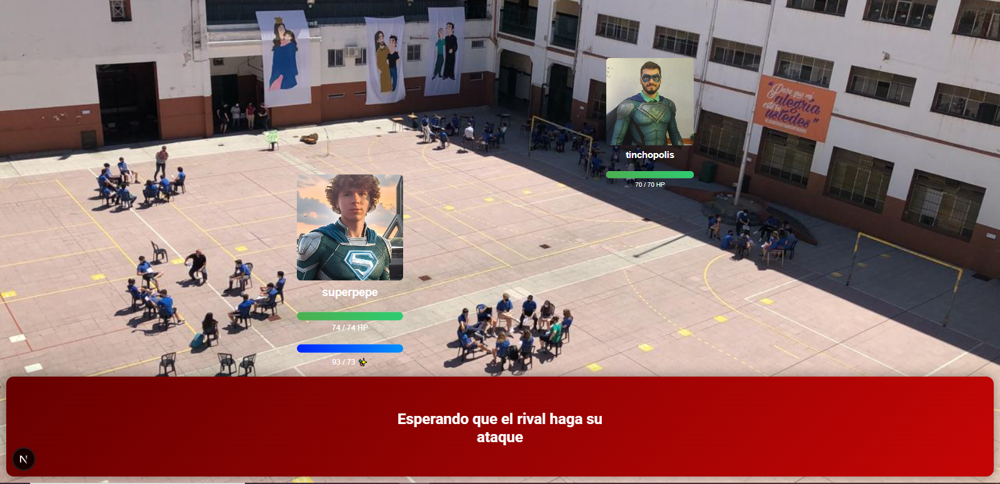

# **Kombat Pio - Juego de Combate Multijugador**

**Kombat Pio** es un juego de combate multijugador en tiempo real, donde los jugadores se enfrentan en duelos de uno contra uno utilizando personajes con habilidades únicas.  
El juego se desarrolla con un sistema de turnos donde los jugadores deben gestionar su energía y seleccionar la mejor habilidad para derrotar a su oponente.  
El frontend está construido con **React**, **Next.js** y **CSS Modules**, mientras que la comunicación en tiempo real se maneja a través de **Socket.IO**.

---

## **Páginas del Juego**

### **Página de Inicio / Login**

La página de **login** permite a los usuarios registrados iniciar sesión en el juego mediante su correo electrónico y contraseña.  
Si el usuario aún no tiene una cuenta, puede acceder al formulario de **registro** para crear una nueva cuenta.  
El proceso de autenticación se realiza mediante una solicitud al backend, que valida los datos proporcionados.  
Si los datos son correctos, el jugador es redirigido al **Menú General**.  
Si la validación falla, se muestra un **popup** con un mensaje de error indicando si los datos son incorrectos o si hubo algún problema al conectar con el servidor.

---

### **Página de Registro**

La página de **registro** permite a los nuevos jugadores crear una cuenta en el sistema.  
El formulario solicita el nombre del jugador, su correo electrónico y una contraseña.  
Tras completar el formulario, se realiza una validación para comprobar si el correo ya está registrado o si la contraseña cumple con los requisitos de seguridad.  
Si la validación es exitosa, el jugador es redirigido a la página de login.  
Si ocurre algún error, como un correo ya registrado o una contraseña no válida, se muestra un **popup** con el mensaje de error correspondiente.

---

### **Menú General**

El **Menú General** es la página principal del juego a la que los jugadores acceden después de iniciar sesión.  
Aquí, el jugador puede ver su nombre y una bienvenida personalizada.  
Además, tiene acceso a varias secciones importantes del juego.  
Desde este menú, el jugador puede ver el **ranking** de los jugadores más exitosos, acceder a su **historial de partidas**, y entrar a la sección **Jugar** para seleccionar su personaje y comenzar una nueva partida.  
También puede cerrar sesión desde esta misma página si lo desea.

---

### **Página de Historial**

En la página de **Historial**, el usuario podrá consultar un registro detallado de todas las partidas que ha jugado en **Kombat Pio**.  
A través de esta funcionalidad, podrá ver un resumen completo de sus victorias y derrotas, proporcionando una visión general de su rendimiento.  
Cada partida incluye información relevante, como el personaje utilizado y el resultado del enfrentamiento.

---

### **Página de Ranking**

La página de **Ranking** muestra la lista de los 10 jugadores con el mejor rendimiento.  
El ranking se ordena según el **win rate** de cada jugador, calculado a partir de sus victorias y derrotas.  
La página permite a los jugadores comparar su rendimiento con el de otros competidores.

---

### **Tutorial**

La página de **Tutorial** guía a los nuevos jugadores en sus primeros pasos dentro de **Kombat Pio**.  
A través de una interfaz visual e interactiva, explica las mecánicas básicas del juego, el funcionamiento del sistema de turnos y cómo usar las habilidades estratégicamente.  
Aquí, el jugador aprende a reconocer los elementos principales del combate: la **barra de salud**, la **energía disponible**, los **botones de habilidades**, y las notificaciones que aparecen durante las acciones.

---

### **Página de Elección de Personaje**

En la página de **Elección de Personaje**, los jugadores seleccionan el personaje que utilizarán en su próxima batalla.  
Se muestra una lista de personajes con sus características (salud, energía y habilidades).  
Al hacer clic en un personaje, se abre un modal con información detallada para confirmar la elección antes de iniciar el combate.

---

### **Página de Juego**

La **Página de Juego** es el núcleo de la experiencia de combate en **Kombat Pio**.  
Los jugadores se enfrentan en batallas en tiempo real usando sus personajes seleccionados.  
El juego sigue un sistema de turnos donde cada jugador elige una habilidad para atacar o defender.  
Cada acción consume energía, y el jugador debe gestionar sus recursos estratégicamente para ganar.  
Durante el combate, se muestran notificaciones con los resultados (ataques, esquivas, daños, etc.), todo sincronizado gracias a **Socket.IO**.

---

## **Tecnologías Utilizadas**

- **Frontend:** React, Next.js, CSS Modules  
- **Backend:** Node.js, Express, Socket.IO para la comunicación en tiempo real

---
